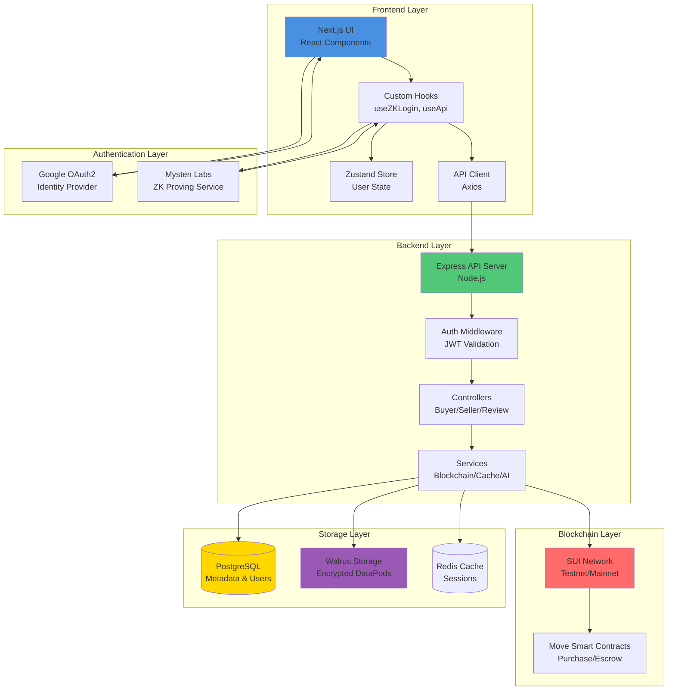
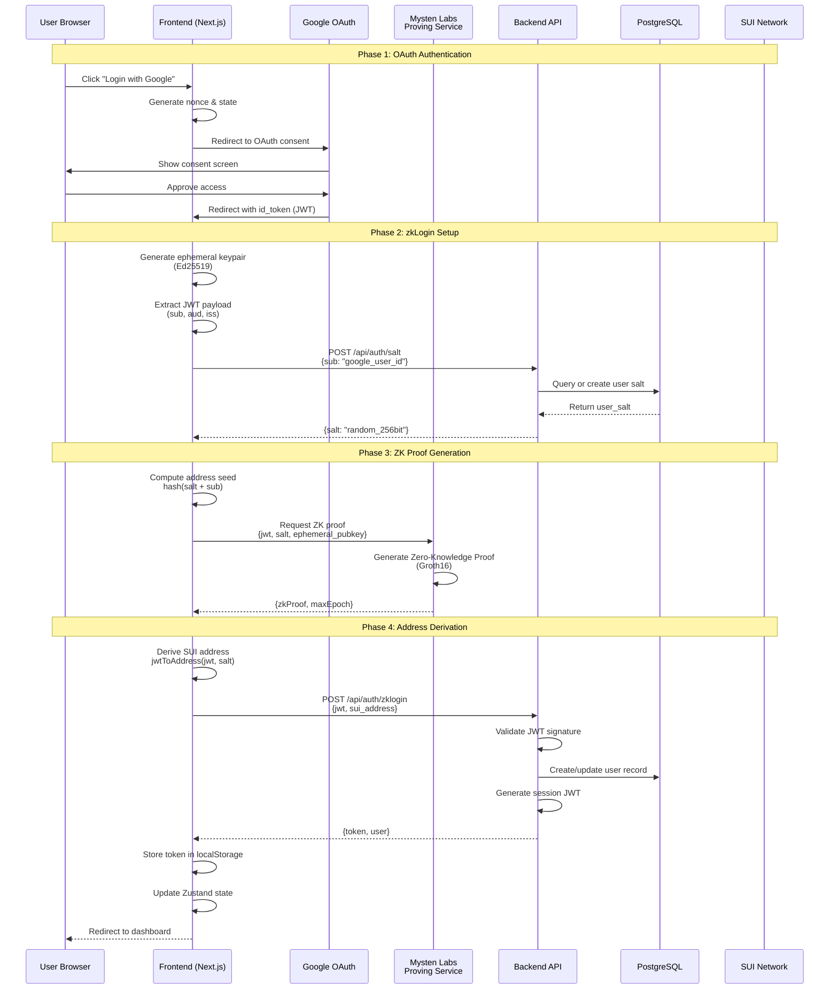
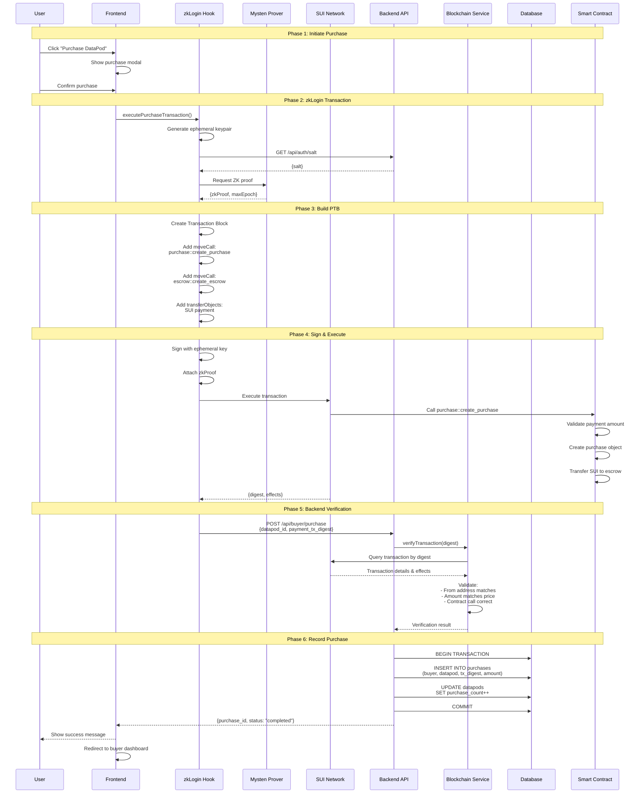
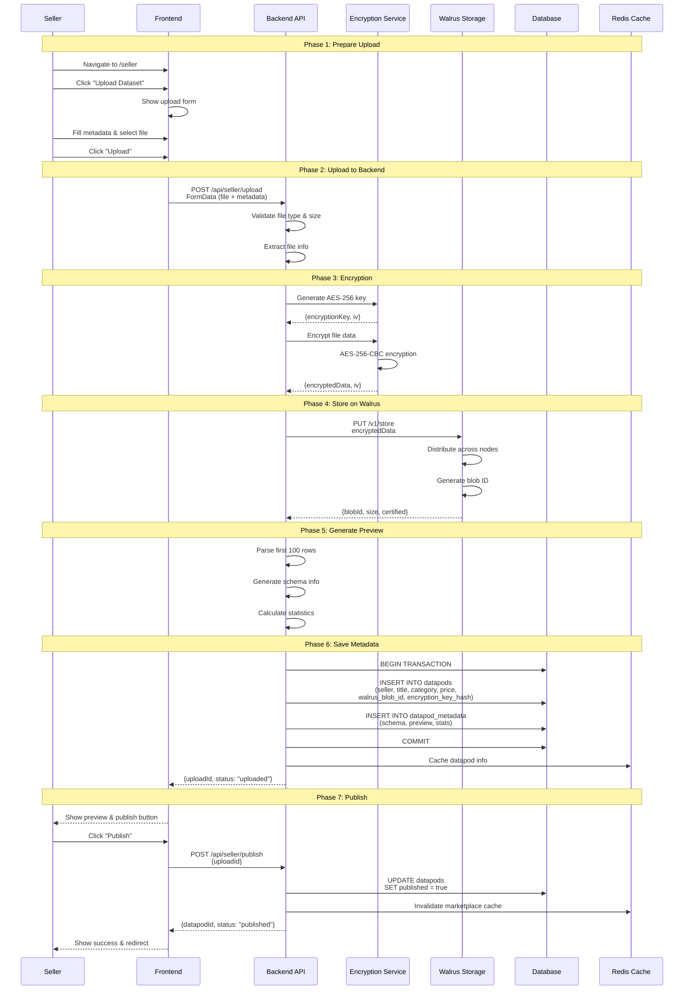
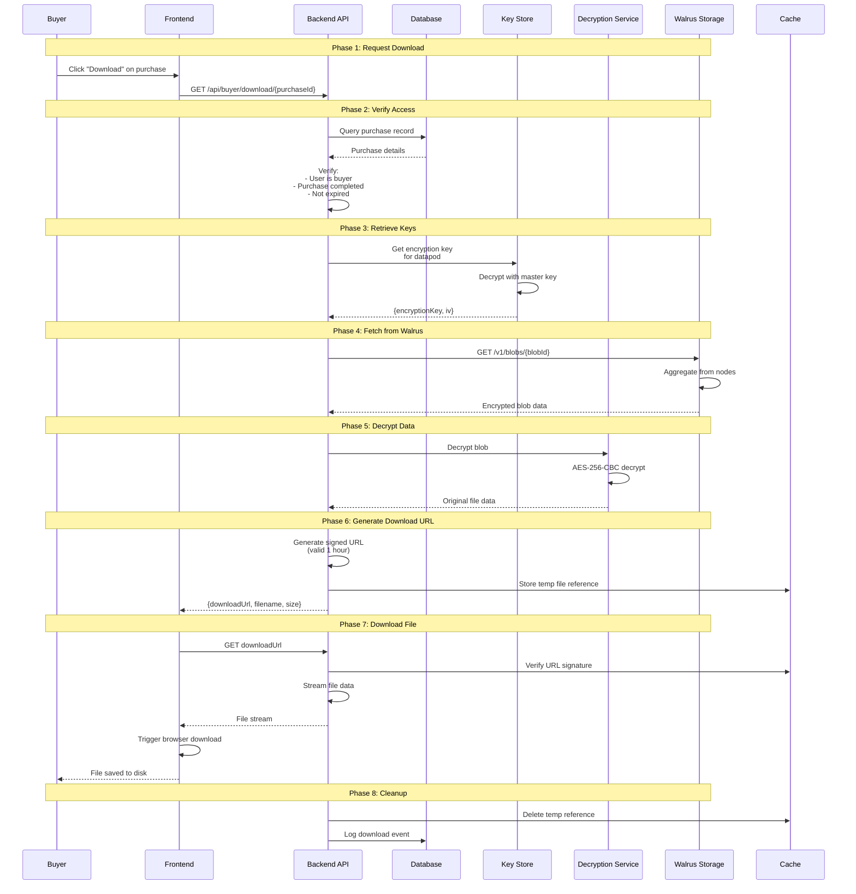
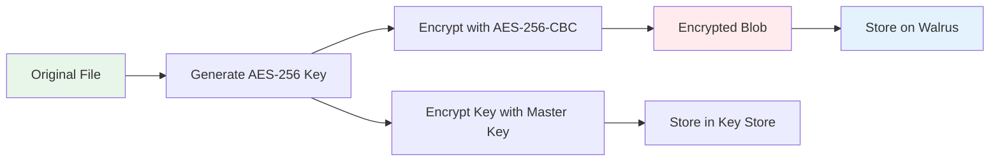
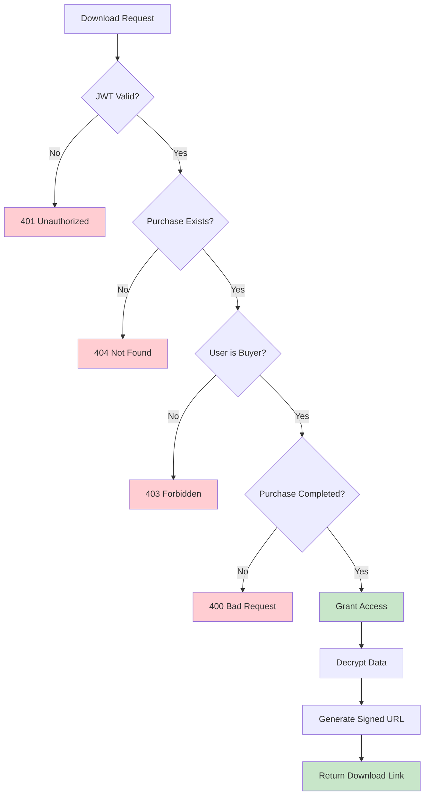

# SourceNet Frontend

SourceNet is a decentralized data marketplace built on the SUI blockchain, enabling secure buying and selling of datasets with privacy-preserving zkLogin authentication and encrypted data delivery.

## 🚀 Quick Start

```bash
npm install
npm run dev
```

Open [http://localhost:3000](http://localhost:3000) to access the application.

## � End-to-End Technical Flow

### System Architecture Overview



### Complete User Journey Flow

```mermaid
graph LR
    A[Visit Site] --> B{Authenticated?}
    B -->|No| C[Login Page]
    B -->|Yes| D[Marketplace]
    
    C --> E[Google OAuth]
    E --> F[zkLogin Setup]
    F --> D
    
    D --> G{User Role?}
    
    G -->|Buyer| H[Browse DataPods]
    H --> I[View Details]
    I --> J[Purchase]
    J --> K[zkLogin Transaction]
    K --> L[Payment Verification]
    L --> M[Buyer Dashboard]
    M --> N[Download Data]
    
    G -->|Seller| O[Upload DataPod]
    O --> P[Encrypt & Store]
    P --> Q[Publish to Marketplace]
    Q --> R[Seller Dashboard]
    R --> S[View Analytics]
    
    M --> T[Submit Review]
    T --> U[Rating Recorded]
    
    style A fill:#E8F5E9
    style D fill:#FFF3E0
    style K fill:#FCE4EC
    style P fill:#E3F2FD
```



---

## 📋 Application Flow

### 1. **Authentication Flow - Technical Deep Dive**

#### Complete zkLogin Authentication Sequence



#### Authentication Data Flow

**Frontend (`useZKLogin` hook)**:
```typescript
// 1. Generate ephemeral keypair
const ephemeralKeyPair = new Ed25519Keypair();

// 2. Request salt from backend
const { salt } = await fetch('/api/auth/salt', {
  method: 'POST',
  body: JSON.stringify({ sub: jwtPayload.sub })
});

// 3. Compute address seed
const addressSeed = genAddressSeed(
  BigInt(salt),
  'sub',
  jwtPayload.sub,
  jwtPayload.aud
);

// 4. Get ZK proof from Mysten Labs
const zkProof = await getZKProof(jwt, salt, ephemeralKeyPair);

// 5. Derive SUI address
const suiAddress = jwtToAddress(jwt, salt);

// 6. Authenticate with backend
const { token } = await api.authenticate(jwt, suiAddress);
```

**Backend (`AuthController`)**:
```typescript
// Validate JWT and create session
async zklogin(req, res) {
  // 1. Verify JWT signature (Google)
  const decoded = jwt.verify(idToken, googlePublicKey);
  
  // 2. Extract user info
  const { sub, email, name } = decoded;
  
  // 3. Find or create user in database
  const user = await User.findOrCreate({
    google_id: sub,
    email,
    name,
    sui_address: req.body.sui_address
  });
  
  // 4. Generate session JWT
  const token = jwt.sign(
    { userId: user.id, suiAddress: user.sui_address },
    process.env.JWT_SECRET,
    { expiresIn: '7d' }
  );
  
  res.json({ token, user });
}
```

---

### 2. **DataPod Purchase Flow - Complete Technical Flow**

#### Purchase Transaction Sequence



#### Purchase Transaction Details

**Frontend Transaction Building**:
```typescript
// Build Programmable Transaction Block
const tx = new Transaction();

// 1. Split SUI coins for payment
const [paymentCoin] = tx.splitCoins(tx.gas, [
  tx.pure(priceInMIST, 'u64')
]);

// 2. Call purchase contract
tx.moveCall({
  target: `${PACKAGE_ID}::purchase::create_purchase`,
  arguments: [
    tx.pure(datapodId, 'address'),
    tx.pure(buyerAddress, 'address'),
    paymentCoin,
    tx.pure(priceInMIST, 'u64')
  ]
});

// 3. Create escrow
tx.moveCall({
  target: `${PACKAGE_ID}::escrow::create_escrow`,
  arguments: [
    tx.object(PURCHASE_REGISTRY),
    paymentCoin,
    tx.pure(sellerAddress, 'address')
  ]
});

// 4. Sign with zkLogin
const signature = await signWithZK(tx, ephemeralKeyPair, zkProof);

// 5. Execute transaction
const result = await suiClient.executeTransactionBlock({
  transactionBlock: tx,
  signature,
  options: {
    showEffects: true,
    showObjectChanges: true
  }
});
```

**Backend Verification Logic**:
```typescript
async createPurchase(req, res) {
  const { datapod_id, payment_tx_digest } = req.body;
  const buyerId = req.user.id;
  
  // 1. Get DataPod details
  const datapod = await DataPod.findById(datapod_id);
  if (!datapod) throw new Error('DataPod not found');
  
  // 2. Verify blockchain transaction
  const txData = await BlockchainService.getTransaction(payment_tx_digest);
  
  // 3. Validate transaction
  if (!txData) throw new Error('Transaction not found');
  if (txData.effects.status.status !== 'success') {
    throw new Error('Transaction failed on-chain');
  }
  
  // 4. Verify payment amount
  const paidAmount = extractPaymentAmount(txData);
  const expectedAmount = datapod.price_sui * 1e9; // Convert to MIST
  
  if (paidAmount < expectedAmount) {
    throw new Error('Insufficient payment');
  }
  
  // 5. Verify sender address
  if (txData.sender !== req.user.sui_address) {
    throw new Error('Address mismatch');
  }
  
  // 6. Check for duplicate
  const existing = await Purchase.findOne({
    where: { payment_tx_digest }
  });
  if (existing) throw new Error('Purchase already recorded');
  
  // 7. Create purchase record
  const purchase = await Purchase.create({
    buyer_id: buyerId,
    datapod_id,
    payment_tx_digest,
    amount_sui: datapod.price_sui,
    status: 'completed'
  });
  
  // 8. Update analytics
  await DataPod.increment('purchase_count', {
    where: { id: datapod_id }
  });
  
  res.json({ purchase });
}
```

---

### 3. **Seller Upload Flow - Complete Technical Process**

#### Upload & Publish Sequence



#### Encryption & Storage Details

**Backend Upload Handler**:
```typescript
async uploadData(req, res) {
  const file = req.file; // Multer middleware
  const metadata = JSON.parse(req.body.metadata);
  const sellerId = req.user.id;
  
  // 1. Validate file
  if (!file) throw new Error('No file uploaded');
  if (file.size > 500 * 1024 * 1024) { // 500MB limit
    throw new Error('File too large');
  }
  
  // 2. Generate encryption key
  const encryptionKey = crypto.randomBytes(32); // 256-bit
  const iv = crypto.randomBytes(16);
  
  // 3. Encrypt file
  const cipher = crypto.createCipheriv('aes-256-cbc', encryptionKey, iv);
  const encryptedData = Buffer.concat([
    cipher.update(file.buffer),
    cipher.final()
  ]);
  
  // 4. Upload to Walrus
  const walrusResult = await WalrusService.store(encryptedData);
  
  // 5. Generate preview (on unencrypted data)
  const preview = await generatePreview(file.buffer, file.mimetype);
  
  // 6. Hash encryption key for storage
  const keyHash = crypto
    .createHash('sha256')
    .update(encryptionKey)
    .digest('hex');
  
  // 7. Store in database
  const datapod = await DataPod.create({
    seller_id: sellerId,
    title: metadata.title,
    description: metadata.description,
    category: metadata.category,
    price_sui: metadata.price,
    walrus_blob_id: walrusResult.blobId,
    walrus_storage_size: walrusResult.size,
    encryption_key_hash: keyHash,
    encryption_iv: iv.toString('hex'),
    file_type: file.mimetype,
    file_size: file.size,
    schema: preview.schema,
    sample_data: preview.sample,
    published: false
  });
  
  // 8. Store encryption key securely (encrypted with master key)
  await EncryptionKeyStore.save(datapod.id, encryptionKey);
  
  res.json({ uploadId: datapod.id });
}
```

---

### 4. **Download Flow - Secure Data Delivery**

#### Download Process Sequence



#### Download Security Implementation

**Backend Download Handler**:
```typescript
async getDownloadUrl(req, res) {
  const { purchaseId } = req.params;
  const userId = req.user.id;
  
  // 1. Verify purchase ownership
  const purchase = await Purchase.findOne({
    where: { id: purchaseId, buyer_id: userId },
    include: [{ model: DataPod, as: 'datapod' }]
  });
  
  if (!purchase) {
    return res.status(404).json({ error: 'Purchase not found' });
  }
  
  if (purchase.status !== 'completed') {
    return res.status(400).json({ error: 'Purchase not completed' });
  }
  
  // 2. Get encryption key
  const encryptionKey = await EncryptionKeyStore.get(
    purchase.datapod.id
  );
  const iv = Buffer.from(purchase.datapod.encryption_iv, 'hex');
  
  // 3. Fetch encrypted data from Walrus
  const encryptedBlob = await WalrusService.fetch(
    purchase.datapod.walrus_blob_id
  );
  
  // 4. Decrypt data
  const decipher = crypto.createDecipheriv(
    'aes-256-cbc',
    encryptionKey,
    iv
  );
  const decryptedData = Buffer.concat([
    decipher.update(encryptedBlob),
    decipher.final()
  ]);
  
  // 5. Generate signed download token
  const downloadToken = jwt.sign(
    {
      purchaseId,
      userId,
      filename: purchase.datapod.title,
      exp: Math.floor(Date.now() / 1000) + 3600 // 1 hour
    },
    process.env.DOWNLOAD_SECRET
  );
  
  // 6. Store temp file in cache
  await CacheService.set(
    `download:${downloadToken}`,
    decryptedData,
    3600 // 1 hour TTL
  );
  
  // 7. Generate download URL
  const downloadUrl = `${process.env.API_URL}/download/${downloadToken}`;
  
  // 8. Log download
  await DownloadLog.create({
    purchase_id: purchaseId,
    buyer_id: userId,
    datapod_id: purchase.datapod.id
  });
  
  res.json({
    downloadUrl,
    filename: purchase.datapod.title,
    size: purchase.datapod.file_size,
    expiresIn: 3600
  });
}
```

---

## 🔌 API Endpoints Reference

### Authentication Endpoints

| Endpoint | Method | Auth | Description |
|----------|--------|------|-------------|
| `/api/auth/salt` | POST | No | Get or create user salt for zkLogin |
| `/api/auth/zklogin` | POST | No | Authenticate with Google JWT + zkLogin |
| `/api/auth/me` | GET | Yes | Get current user info |
| `/api/auth/profile` | PUT | Yes | Update user profile |

### Marketplace Endpoints

| Endpoint | Method | Auth | Description |
|----------|--------|------|-------------|
| `/api/marketplace/datapods` | GET | No | List all published DataPods |
| `/api/marketplace/datapods/:id` | GET | No | Get DataPod details |
| `/api/marketplace/top-rated` | GET | No | Get top rated DataPods |
| `/api/marketplace/categories` | GET | No | List all categories |

### Seller Endpoints

| Endpoint | Method | Auth | Description |
|----------|--------|------|-------------|
| `/api/seller/upload` | POST | Yes | Upload new dataset |
| `/api/seller/publish` | POST | Yes | Publish uploaded DataPod |
| `/api/seller/datapods` | GET | Yes | List seller's DataPods |
| `/api/seller/datapods/:id` | PUT | Yes | Update DataPod metadata |
| `/api/seller/datapods/:id` | DELETE | Yes | Delete DataPod |
| `/api/seller/stats` | GET | Yes | Get seller analytics |

### Buyer Endpoints

| Endpoint | Method | Auth | Description |
|----------|--------|------|-------------|
| `/api/buyer/purchase` | POST | Yes | Record purchase after on-chain tx |
| `/api/buyer/purchases` | GET | Yes | List buyer's purchases |
| `/api/buyer/purchase/:id` | GET | Yes | Get purchase details |
| `/api/buyer/download/:id` | GET | Yes | Get download URL for purchase |
| `/api/buyer/purchase/:id/review` | POST | Yes | Submit review for purchase |

### Review Endpoints

| Endpoint | Method | Auth | Description |
|----------|--------|------|-------------|
| `/api/review/my-reviews` | GET | Yes | List user's reviews |
| `/api/review/datapod/:id` | GET | No | Get reviews for DataPod |
| `/api/review/:id` | DELETE | Yes | Delete own review |

---

## 💾 Database Schema

### Core Tables

```sql
-- Users table
CREATE TABLE users (
    id UUID PRIMARY KEY DEFAULT gen_random_uuid(),
    google_id VARCHAR(255) UNIQUE NOT NULL,
    email VARCHAR(255) UNIQUE NOT NULL,
    name VARCHAR(255),
    sui_address VARCHAR(66) UNIQUE NOT NULL,
    salt VARCHAR(64) NOT NULL, -- zkLogin salt
    created_at TIMESTAMP DEFAULT NOW(),
    updated_at TIMESTAMP DEFAULT NOW()
);

-- DataPods table
CREATE TABLE datapods (
    id UUID PRIMARY KEY DEFAULT gen_random_uuid(),
    seller_id UUID REFERENCES users(id),
    title VARCHAR(255) NOT NULL,
    description TEXT,
    category VARCHAR(50),
    price_sui DECIMAL(20, 9) NOT NULL,
    walrus_blob_id VARCHAR(255) UNIQUE NOT NULL,
    walrus_storage_size BIGINT,
    encryption_key_hash VARCHAR(64) NOT NULL,
    encryption_iv VARCHAR(32) NOT NULL,
    file_type VARCHAR(100),
    file_size BIGINT,
    schema JSONB,
    sample_data JSONB,
    published BOOLEAN DEFAULT false,
    purchase_count INTEGER DEFAULT 0,
    average_rating DECIMAL(3, 2) DEFAULT 0,
    created_at TIMESTAMP DEFAULT NOW(),
    updated_at TIMESTAMP DEFAULT NOW()
);

-- Purchases table
CREATE TABLE purchases (
    id UUID PRIMARY KEY DEFAULT gen_random_uuid(),
    buyer_id UUID REFERENCES users(id),
    datapod_id UUID REFERENCES datapods(id),
    payment_tx_digest VARCHAR(100) UNIQUE NOT NULL,
    amount_sui DECIMAL(20, 9) NOT NULL,
    status VARCHAR(20) DEFAULT 'pending_payment',
    created_at TIMESTAMP DEFAULT NOW(),
    updated_at TIMESTAMP DEFAULT NOW()
);

-- Reviews table
CREATE TABLE reviews (
    id UUID PRIMARY KEY DEFAULT gen_random_uuid(),
    purchase_id UUID REFERENCES purchases(id) UNIQUE,
    buyer_id UUID REFERENCES users(id),
    datapod_id UUID REFERENCES datapods(id),
    rating INTEGER CHECK (rating >= 1 AND rating <= 5),
    comment TEXT,
    created_at TIMESTAMP DEFAULT NOW(),
    updated_at TIMESTAMP DEFAULT NOW()
);

-- Download logs
CREATE TABLE download_logs (
    id UUID PRIMARY KEY DEFAULT gen_random_uuid(),
    purchase_id UUID REFERENCES purchases(id),
    buyer_id UUID REFERENCES users(id),
    datapod_id UUID REFERENCES datapods(id),
    downloaded_at TIMESTAMP DEFAULT NOW()
);
```

---

## 🔐 Security & Encryption Flow

### Encryption at Rest



### Key Management

- **Master Encryption Key**: Stored in environment variables (`MASTER_ENCRYPTION_KEY`)
- **Per-DataPod Keys**: Randomly generated AES-256 keys
- **Key Storage**: Encrypted with master key before database storage
- **IV (Initialization Vector)**: Unique per DataPod, stored in database
- **Key Rotation**: Manual rotation supported via admin API

### Access Control Flow



---

## �📋 Application Flow

### 1. **Authentication Flow**

#### Google OAuth2 + zkLogin
- User clicks "Login with Google" on `/login`
- Redirects to Google OAuth consent screen
- Google redirects back to `/callback` with JWT token
- Frontend generates ephemeral key pair for zkLogin
- Requests user salt from backend (`/api/auth/salt`)
- Obtains ZK proof from Mysten Labs proving service
- Derives SUI address from zkLogin credentials
- Backend validates and issues JWT auth token

### 2. **Marketplace Browsing** (`/`)

#### Discovery
- Browse all available DataPods (datasets) in grid layout
- Filter by category (All, Finance, Health, Marketing, etc.)
- Sort by: Most Relevant, Highest Rating, Lowest/Highest Price
- Search datasets by name or description
- View dataset details including:
  - Title, description, and category
  - Price in SUI tokens
  - Average rating and review count
  - Seller information
  - Preview images

### 3. **DataPod Purchase Flow**

#### Viewing Details (`/datapod/[id]`)
- View comprehensive dataset information
- Check seller reputation and reviews
- Review dataset metadata and usability
- See sample data (if available)

#### Making a Purchase
1. Click "Purchase" button on DataPod detail page
2. **zkLogin Transaction Flow**:
   - Generate ephemeral keypair
   - Request user salt from backend
   - Create ZK proof via Mysten Labs service
   - Build Programmable Transaction Block (PTB) that calls:
     - `purchase::create_purchase` - Records purchase on-chain
     - `escrow::create_escrow` - Locks payment in escrow
   - Execute co-signed transaction (frontend + backend sponsor)
   - Transaction digest returned on success

3. **Backend Verification**:
   - Submit transaction digest to `/api/buyer/purchase`
   - Backend verifies transaction on SUI blockchain
   - Creates purchase record in database
   - Purchase status: `pending_payment` → `completed`

4. **Payment Settlement**:
   - Backend validates payment amount matches DataPod price
   - Transfers funds from escrow to seller
   - Buyer's purchase appears in their dashboard

### 4. **Buyer Dashboard** (`/buyer`)

#### Manage Purchases
- View all purchased DataPods
- Filter by status: All, Completed, Pending
- See purchase history with timestamps
- Access download links for completed purchases
- Submit reviews and ratings for purchased data

#### Downloading Data
1. Navigate to buyer dashboard
2. Click "Download" on a completed purchase
3. Frontend requests download URL (`/api/buyer/download/[purchaseId]`)
4. Backend validates ownership and purchase status
5. Generates time-limited, signed download URL from Walrus storage
6. Decrypts data using buyer's encryption keys
7. Downloads dataset file to local machine

### 5. **Seller Dashboard** (`/seller`)

#### Upload & Publish DataPods
1. Navigate to seller dashboard
2. Click "Upload New Dataset"
3. Fill in dataset metadata:
   - Title and description
   - Category selection
   - Price in SUI
   - File upload (CSV, JSON, etc.)
4. Submit upload to backend (`/api/seller/upload`)
5. Backend:
   - Encrypts data using AES-256
   - Stores encrypted blob on Walrus distributed storage
   - Generates metadata and preview
6. Publish DataPod (`/api/seller/publish`)
7. DataPod becomes available on marketplace

#### Manage Listings
- View all published DataPods
- Edit DataPod details and pricing
- Unpublish or delete listings
- View sales analytics and earnings

### 6. **Review System** (`/review`)

#### Submit Reviews
- Rate purchases 1-5 stars
- Write detailed review comments
- Reviews tied to verified purchases only
- Submit via `/api/buyer/purchase/[purchaseId]/review`

#### View Reviews
- Browse own reviews (`/api/review/my-reviews`)
- See DataPod reviews on detail pages
- Reviews include rating, comment, and timestamp

### 7. **Profile Management** (`/profile`)

#### Update Profile
- View account information
- Update display name and bio
- View wallet address (derived from zkLogin)
- Manage authentication settings

## 🔐 Key Technologies

- **Authentication**: Google OAuth2 + SUI zkLogin
- **Blockchain**: SUI Network (testnet/mainnet)
- **Storage**: Walrus distributed storage
- **Encryption**: AES-256 for data at rest
- **Frontend**: Next.js 16, React 19, TailwindCSS
- **State Management**: Zustand
- **Blockchain SDK**: @mysten/sui, @mysten/dapp-kit

## 🏗️ Architecture Highlights

### zkLogin Integration
- Passwordless authentication via Google
- Privacy-preserving SUI address derivation
- No private key management required
- ZK proofs generated via Mysten Labs service

### Two-Endpoint Payment Flow
1. **Frontend**: Constructs and executes transaction
2. **Backend**: Co-signs transaction, covers gas fees
3. Transaction verified on-chain before purchase recording

### Encrypted Data Delivery
- End-to-end encryption for datasets
- Access control via purchase verification
- Time-limited download URLs
- Decryption keys derived from buyer credentials

## 📁 Project Structure

```
app/
├── (auth)/                 # Authentication pages
│   ├── login/             # Google OAuth login
│   ├── callback/          # OAuth callback handler
│   └── wallet-login/      # Alternative wallet auth
├── (main)/                # Main application pages
│   ├── buyer/             # Buyer dashboard
│   ├── seller/            # Seller dashboard
│   ├── datapod/[id]/      # DataPod detail page
│   ├── profile/           # User profile
│   └── review/            # Review management
├── components/            # Reusable UI components
├── hooks/                 # Custom React hooks
│   ├── useZKLogin.ts      # zkLogin authentication
│   ├── useWalletAuth.ts   # Wallet connection
│   └── useApi.ts          # API client hooks
├── utils/                 # Utility functions
│   ├── api.client.ts      # API service layer
│   ├── zklogin.utils.ts   # zkLogin helpers
│   └── crypto.utils.ts    # Encryption utilities
└── types/                 # TypeScript type definitions
```

## 🔗 Related Repositories

- **Backend**: `sourcenet-backend` - Express API server
- **Smart Contracts**: SUI Move contracts for purchases and escrow
- **Indexer**: `sourcenet-indexer` - Blockchain event indexer

## 📝 License

MIT LICENSE
